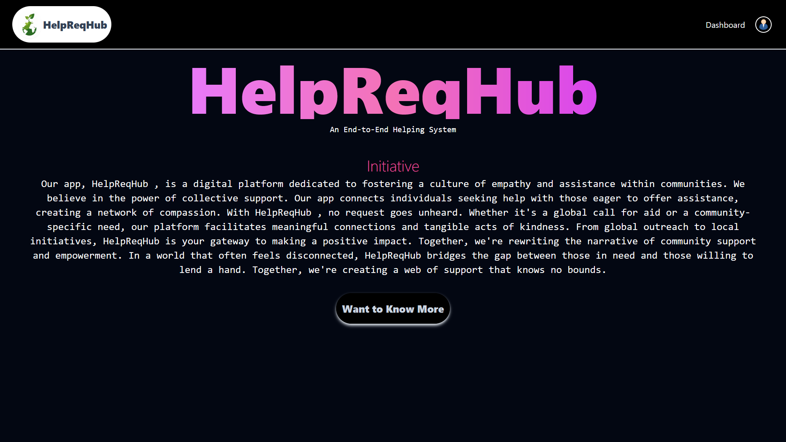
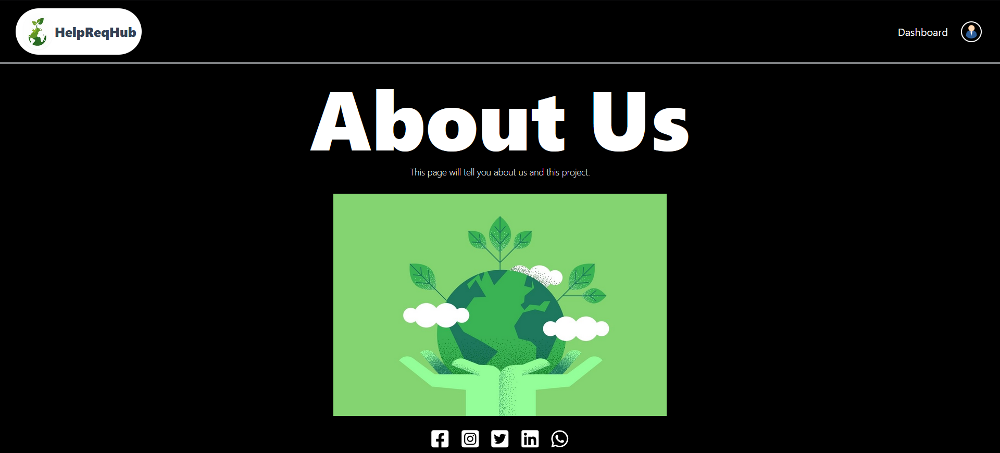
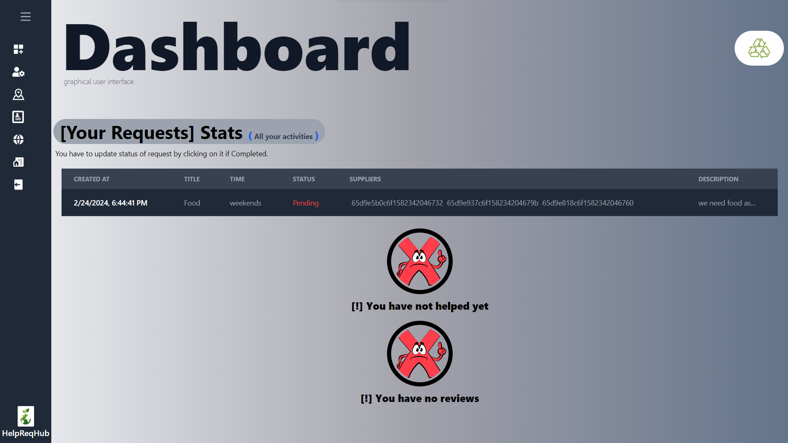
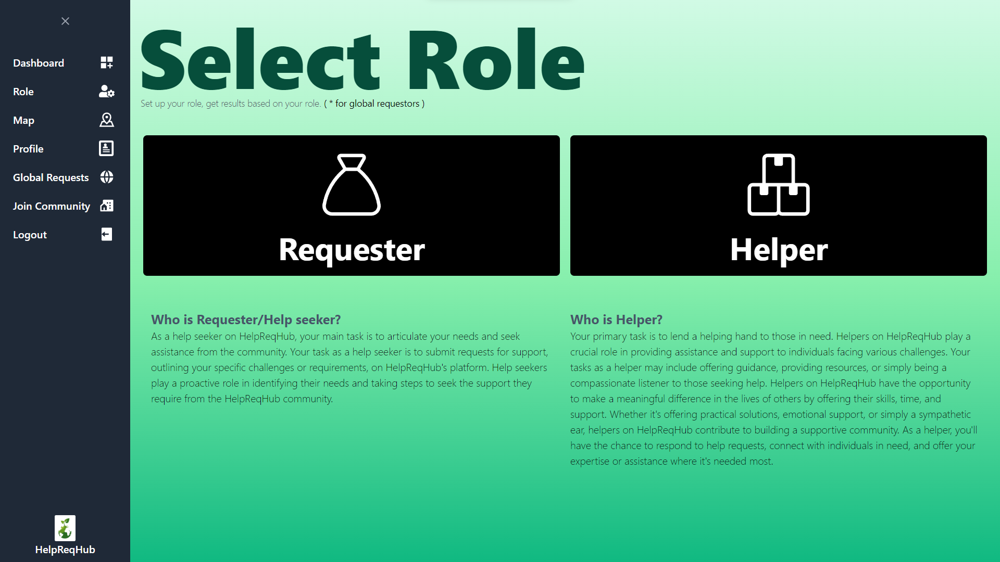
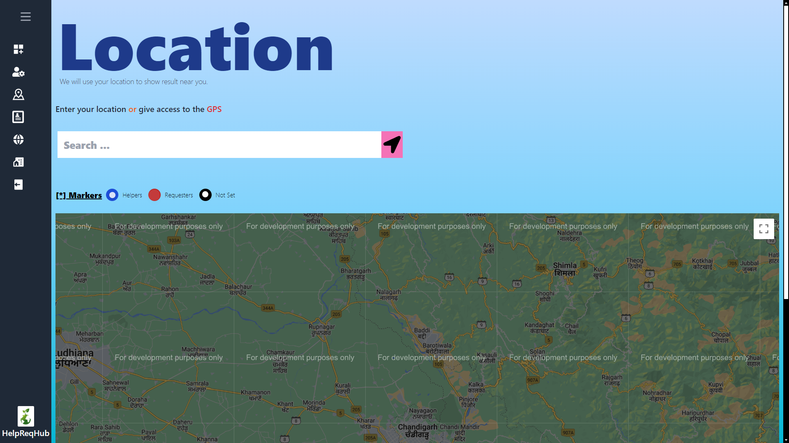
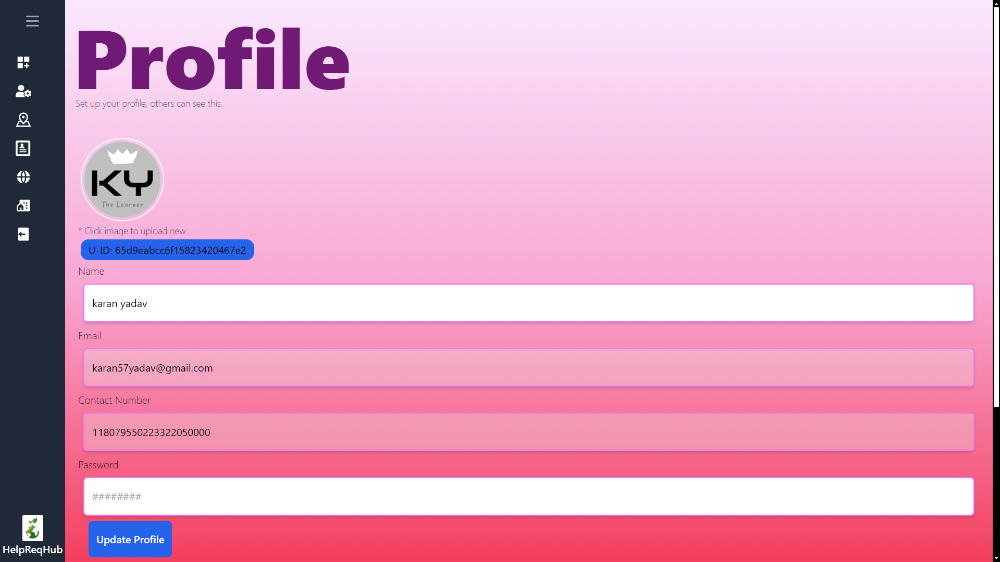
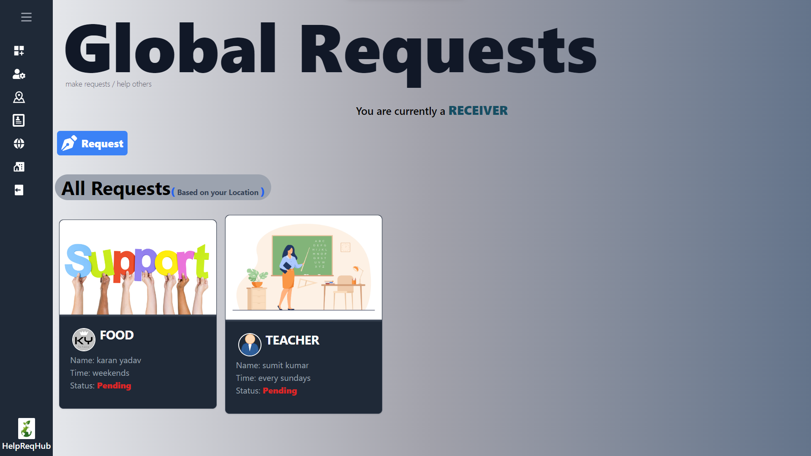
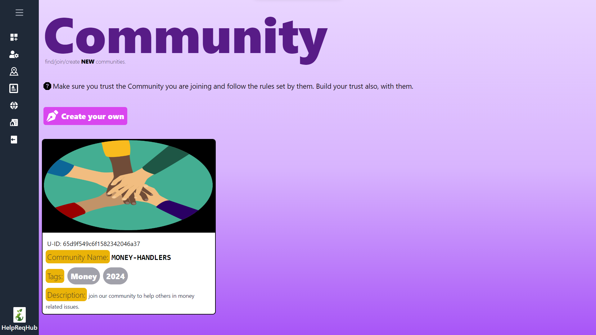
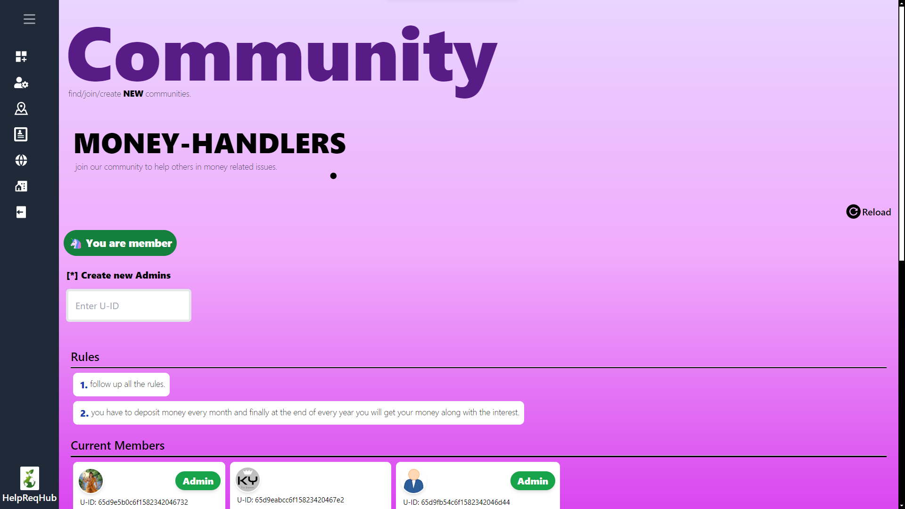

# HelpReqHub [Team: KAK-CHaLLENGeRs]

An End-to-End Helping System


## Index

1. [Introduction](#introduction)
2. [SDG's Goals](#sdgs-goals)
3. [Demo](#demo)
4. [Screenshots](#screenshots)
5. [Features](#features)
6. [Installation Steps](#installation-steps)
7. [API Keys Setup](#api-keys-setup)
    - [Firebase Setup](#firebase-setup)
    - [Mongodb Setup](#mongodb-setup)
    - [Next Auth Setup](#next-auth-setup)
    - [Google APIs](#google-apis)
8. [Contribution Guidelines](#contribution-guidelines)
9. [Built with](#built-with)
10. [License](#license)
11. [Like our work](#like-our-work)

## Introduction

Our app, `HelpReqHub`, is a digital platform dedicated to fostering a culture of empathy and assistance within communities. We believe in the power of collective support. Our app connects individuals seeking help with those eager to offer assistance, creating a network of compassion. With `HelpReqHub`, no request goes unheard. Whether it's a global call for aid or a community-specific need, our platform facilitates meaningful connections and tangible acts of kindness. From global outreach to local initiatives, `HelpReqHub` is your gateway to making a positive impact. Together, we're rewriting the narrative of community support and empowerment. In a world that often feels disconnected, `HelpReqHub` bridges the gap between those in need and those willing to lend a hand. Together, we're creating a web of support that knows no bounds.

**`Problem Statement`**

Basically we are creating a web application in which users can create up free account and go to the dashboard and ask
for request/help they want and choose role between receiver/requestor or supplier/helper and other(suppliers/helpers)
who are willingly want to help him/her can help, he/she can also create community/groups and members will join that community and within that community only they can ask for help and previous one was globally i.e every logged person can see the request.

- a community-driven platform that connects individuals in need with willing helpers
- aims to reduce social inequality and build sustainable communities, contributing to the United Nations Sustainable Development Goals of No Poverty, Zero Hunger, Reduced Inequality, and Sustainable Cities and Communities.
- It tackles issues of poverty, hunger, and limited access to resources by facilitating the redistribution of surplus food from events and hotels to those facing food-related hardships.
- Additionally, the platform empowers users to discreetly seek financial assistance within trusted
communities, addressing privacy concerns. AND MUCH MORE...

[](https://opensource.org/licenses/MIT)

[](https://nextjs.org/)

[](https://tailwindcss.com/)

[](https://www.google.com/)

[](mailto:xpresskaran98@gmail.com)

[](CONTRIBUTING.md)


## SDG's [Goals]

- `SDG 1` - No Poverty
- `SDG 2` - Zero Hunger
- `SDG 17` - Partnerships for the Goals
- `SDG 11` - Sustainable Cities and Communities
- `SDG 8` - Decent Work and Economic Growth
- `SDG 3` - Good Health and Wellbeing

I majorly focused on partnership i.e people should have trust in one another and they should
help others in bad situation, I have seen this in my locality since childhood that my family
members used to deposit money to group of admins every month and those provide money on
low interest to other member in order to help and after every year end they give back the money
along with the interest what we should get, thought the interest is low but we help others
through this. Other goals are also linked through this only.

## 🚀 Demo


## 📷 Screenshots




















## 🧐 Features

- `User Authentication`: Allow users to sign up, log in, and manage their accounts securely.
- `Profile Management`: Enable users to create and update their profiles, including personal information, contact details, and profile pictures.
- `Request Creation`: Allow users to create requests for help, specifying the type of assistance needed, description, time constraints, and location.
- `Request Discovery`: Provide a platform for users to discover and browse through active requests posted by others, filtering by category, location, or urgency.
- `*Matching Algorithm`: Implement a matching algorithm to connect users seeking help with users offering assistance, based on factors such as location, skills, availability, and preferences. 
- `Community Creation`: Allow users to create and join communities or groups based on shared interests, locations, or causes, where they can collaborate and offer support within a smaller community.
- `Community Moderation`: Empower community administrators to moderate discussions, approve new members, set community rules, and manage community events or initiatives.
- `*Real-Time Messaging`: Enable users to communicate with each other in real-time through instant messaging, facilitating coordination and collaboration on help requests.
- `Request Status Tracking`: Provide tools for users to track the status of their requests, including updates from helpers, progress notes, and completion notifications.
- `Rating and Reviews`: Allow users to rate and review each other based on their interactions, helping to build trust and credibility within the community.
- `*Notification System`: Implement a notification system to alert users about new requests, messages, community updates, and other relevant activities.
- `*Mobile App Support`: Develop a mobile app version of the platform to provide users with convenient access to HelpReqHub on their smartphones and tablets.
- `Integration with External Services`: Integrate with external services such as mapping APIs, payment gateways, social media platforms, or volunteer management tools to enhance functionality and user experience.
- `*Accessibility and Localization`: Ensure the platform is accessible to users with disabilities and supports multiple languages and cultural preferences to cater to a diverse user base.
- `Feedback`: Collect user feedback systematically and iteratively improve the platform based on user suggestions. Prioritize features that enhance user experience and address emerging needs.

- _* (In Making [Future])_

## Architecture

- Frontend (Next.js and Tailwind CSS) This component is responsible for rendering the user interface, handling user interactions, and communicating with the backend services. It includes pages for account creation, dashboards, request creation, and community management.

- Authentication (Firebase Authentication)Manages user authentication, registration, and login. Firebase Authentication provides secure and easy-to-integrate authentication services, ensuring that only authorized users can access the application.

- MongoDB Database and Firebase Storage (for additional data storage)

## 🛠️ Installation Steps

- Clone the repository

    ```bash
    git clone https://github.com/Google-Challengers/HelpReqHub.git
    ```

- Change the directory

    ```bash
    cd HelpReqHub
    ```

- Create a .env file

    ```bash
    touch .env
    ```

- Copy all the required variables from `.env.example`

    ```bash
    cp -r .env.example .env
    ```

- `Locally`: Install the dependencies

    ```bash
    npm install
    ```

- Run the `dev` script for developers

    ```bash
    npm run dev
    ```

- `Docker`: use Dockerfile

    ```bash
    docker build
    ```

- Roll the container using GUI or CLI

- Visit [<http://localhost:3000> or the link shown in the terminal]  in your browser

### How to get the API keys?

#### Firebase setup

- Create up account on the firebase

- Register the app

- get the API keys and paste them in the .env file

- enable the storage for the application and set the rules for making requests

#### Mongodb setup

- **_Locally_** install the mongodb then paste the uri `mongodb://0.0.0.0:27017/helpreqhub` in .env

- **_Online_** login on the mongodb website and create cluster then paste the uri in .env

#### Next Auth setup

- Visit the Next Auth official website to do the setup

- Link: <https://next-auth.js.org/providers/google>

#### Google APIs

- Visit Google Cloud console and create up an account

- Register your application

- Enable Google Maps API and places API along with Billing

## 🍰 Contributon Guidelines

follow up the `Contribution.md`

## 💻 Built with

- [Next.js](https://nextjs.org/) - React framework for building server-rendered applications.
- [NextAuth.js](https://next-auth.js.org/) - Authentication library for Next.js applications.
- [React](https://reactjs.org/) - JavaScript library for building user interfaces.
- [React DOM](https://reactjs.org/docs/react-dom.html) - Entry point to the DOM and server renderers for React.
- [React Google Maps API](https://react-google-maps-api-docs.vercel.app/) - Google Maps JavaScript API wrapper for React.
- [Axios](https://axios-http.com/) - Promise-based HTTP client for the browser and Node.js.
- [Bcrypt](https://www.npmjs.com/package/bcrypt) - Library to help hash passwords.
- [Clsx](https://www.npmjs.com/package/clsx) - Tiny utility for constructing className strings conditionally.
- [Firebase](https://firebase.google.com/) - Platform developed by Google for creating mobile and web applications.
- [Google Map React](https://www.npmjs.com/package/google-map-react) - Google Maps library for React.
- [Mongoose](https://mongoosejs.com/) - MongoDB object modeling for Node.js.
- [UUID](https://www.npmjs.com/package/uuid) - Simple, fast generation of RFC4122 UUIDs.
- [React Icons](https://react-icons.github.io/react-icons/) - Icons library for React.
- [Mongodb](https://www.mongodb.com/) - NoSQL database
- Google Products

## 🛡️ License

This project is licensed under the MIT

## 💖Like our work
